# Lotto Game Project

## Table of Contents

- [Italian Lottery Game](#italian-lottery-game)<br>
- [How to Play](#how-to-play)<br>
    - [1. Step - Add Tickets](#1-step---add-tickets)<br>
    - [2. Step - Print Tickets](#2-step---print-tickets)<br>
    - [3. Step - Generate and Display Extraction](#3-step---generate-and-display-extraction)<br>
    - [4. Step - Check Win](#4-step---check-win)<br>
    - [5. Step - Clear Tickets and Extraction](#5-step---clear-all-tickets-and-extraction)<br>

### Italian Lottery Game

This project simulates the "Lotto," the Italian Lottery Game, which involves tickets and number extractions.

Each ticket consists of a selection of numbers (minimum 1, maximum 10), a choice of 'ruote', the combination to play, and the amount to bet. The numbers available for selection range from 1 to 90 inclusive, and the same number cannot be chosen more than once on each ticket.

Specifically, the 'ruote' include:

- Bari
- Cagliari
- Firenze
- Genova
- Milano
- Napoli
- Palermo
- Roma
- Torino
- Venezia

The combinations are:

- **Ambata**: guess one extracted number
- **Ambo**: guess two extracted numbers
- **Terno**: guess three extracted numbers
- **Quaterna**: guess four extracted numbers
- **Cinquina**: guess five extracted numbers

The Extraction process involves drawing 5 random numbers from 1 to 90 for each of the 10 'ruote'. To win, the numbers on your ticket must match the extracted numbers based on the 'ruota' and combination you have bet on.

### How to Play

In order to start a new game you need to run this following command on terminal:

```sh
node index.js
```

When you launch the game you will arrive in the main menu

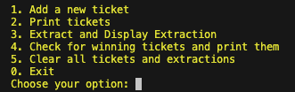

#### 1. Step - Add Tickets

To add a new ticket, select _**"add a new ticket"**_. You will be prompted to:

Enter how many numbers you want to play.

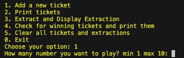

Choose the "ruote". Enter each "ruota" separated by a comma, without spaces.

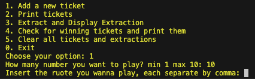

Select the combination. Enter each combination separated by a comma, without spaces.

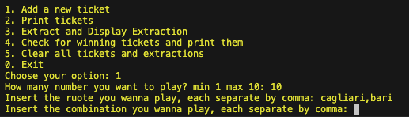

Specify the amount you want to bet. Enter a numerical value only.

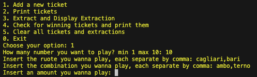

If all information is entered correctly, the ticket will be added, and the following confirmation will be displayed:

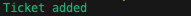

To add another ticket, press _**'y'**_. To return to the main menu, press _**'n'**_.


If the "numbers" are more then 10 or less then 1, the following error message will appear:

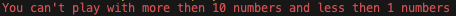

If the "ruota" or combination is entered incorrectly, the following error message will appear:

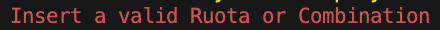

#### 2. Step - Print Tickets

After adding your ticket, you can view all your tickets by pressing _**'2'**_ in the Main Menu.

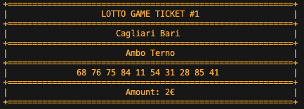

IMPORTANT - Attempting to display tickets before adding any will result in an error:

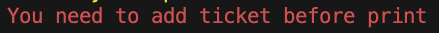

#### 3. Step - Generate and Display Extraction

Press _**'3'**_ on the Main Menu to display and simulate the extraction for all "Ruote".

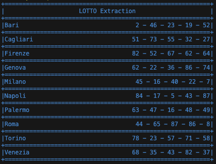

IMPORTANT - If you generate the extraction without adding a ticket first, you will receive an error.

To display the current extraction again, press _**"y"**_.


To generate a new extraction, press _**"n"**_ and then clear all tickets by pressing _**'5'**_ in the main menu.
 
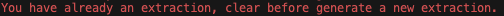

#### 4. Step - Check Win

If you have already added the ticket and generated the extraction, you can check if you have won by displaying the win in green color or the loss in red color.

#### 5. Step - Clear All Tickets and Extraction

After completing all the steps, you can decide to play again. Press _**'5'**_ to clear all tickets and extraction.

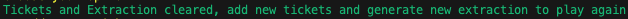
